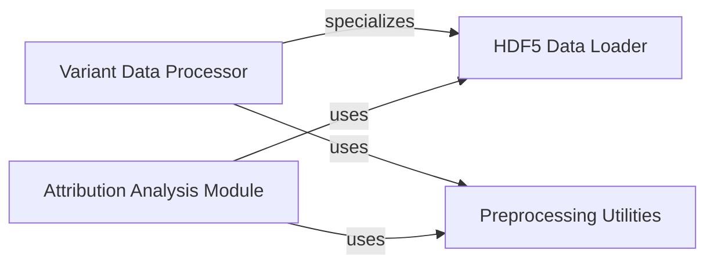

## Component Details

The Data Management subsystem is responsible for the robust handling of biological sequence and gene expression data. It encompasses functionalities for reading and processing HDF5 files, managing genetic variant data, and preparing inputs for downstream analysis, including attribution studies. This subsystem ensures efficient data loading, augmentation, and transformation to support various computational biology tasks.

### HDF5 Data Loader
Manages the loading and initial processing of gene sequence and expression data from HDF5 files, including gene indexing, listing, and extraction of specific data points. It provides core utilities for data access and interacts with preprocessing utilities.

**Related Classes/Methods**:

- <a href="https://github.com/Genentech/decima/blob/master/src/decima/read_hdf5.py#L74-L157" target="_blank" rel="noopener noreferrer">`decima.src.decima.read_hdf5.HDF5Dataset` (74:157)</a>
- <a href="https://github.com/Genentech/decima/blob/master/src/decima/read_hdf5.py#L39-L41" target="_blank" rel="noopener noreferrer">`decima.src.decima.read_hdf5.get_gene_idx` (39:41)</a>
- <a href="https://github.com/Genentech/decima/blob/master/src/decima/read_hdf5.py#L30-L36" target="_blank" rel="noopener noreferrer">`decima.src.decima.read_hdf5.list_genes` (30:36)</a>
- <a href="https://github.com/Genentech/decima/blob/master/src/decima/read_hdf5.py#L50-L64" target="_blank" rel="noopener noreferrer">`decima.src.decima.read_hdf5.extract_gene_data` (50:64)</a>
- <a href="https://github.com/Genentech/decima/blob/master/src/decima/read_hdf5.py#L44-L47" target="_blank" rel="noopener noreferrer">`decima.src.decima.read_hdf5._extract_center` (44:47)</a>

### Variant Data Processor
Specializes in handling genetic variant data, including loading variant information, preparing mutated input sequences, and applying mutations for downstream analysis. It builds upon the HDF5 Data Loader for base data access.

**Related Classes/Methods**:

- <a href="https://github.com/Genentech/decima/blob/master/src/decima/read_hdf5.py#L160-L249" target="_blank" rel="noopener noreferrer">`decima.src.decima.read_hdf5.VariantDataset` (160:249)</a>
- <a href="https://github.com/Genentech/decima/blob/master/src/decima/read_hdf5.py#L67-L71" target="_blank" rel="noopener noreferrer">`decima.src.decima.read_hdf5.mutate` (67:71)</a>

### Preprocessing Utilities
Provides general utility functions for preparing and transforming raw data into a suitable format for model input, specifically including functions for creating inputs for variant analysis.

**Related Classes/Methods**:

- <a href="https://github.com/Genentech/decima/blob/master/src/decima/preprocess.py#L268-L281" target="_blank" rel="noopener noreferrer">`decima.src.decima.preprocess.make_inputs` (268:281)</a>

### Attribution Analysis Module
Focuses on generating attributions by processing gene data, relying on the HDF5 Data Loader for data retrieval and Preprocessing Utilities for data preparation.

**Related Classes/Methods**:

- `decima.src.decima.interpret` (full file reference)

### [FAQ](https://github.com/CodeBoarding/GeneratedOnBoardings/tree/main?tab=readme-ov-file#faq)