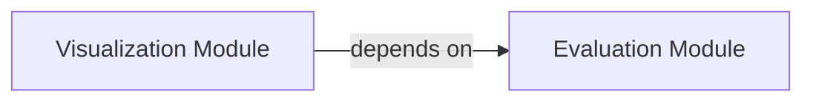

## Component Details

The Evaluation and Visualization component of `decima` is responsible for quantitatively assessing the model's performance, particularly in marker gene analysis, and for generating various plots and visual representations of these evaluation results. The main flow involves the Evaluation Module computing metrics and z-scores, which are then utilized by the Visualization Module to create insightful graphical summaries.

### Evaluation Module
This module provides core functionalities for quantitatively assessing model performance, particularly focusing on marker gene analysis. It includes functions for calculating and comparing marker z-scores, matching criteria for data filtering, and computing various marker-related metrics, preparing data for in-depth analysis and visualization.

**Related Classes/Methods**:

- <a href="https://github.com/Genentech/decima/blob/master/src/decima/evaluate.py#L33-L37" target="_blank" rel="noopener noreferrer">`decima.src.decima.evaluate.compare_marker_zscores` (33:37)</a>
- <a href="https://github.com/Genentech/decima/blob/master/src/decima/evaluate.py#L20-L30" target="_blank" rel="noopener noreferrer">`decima.src.decima.evaluate.marker_zscores` (20:30)</a>
- <a href="https://github.com/Genentech/decima/blob/master/src/decima/evaluate.py#L8-L17" target="_blank" rel="noopener noreferrer">`decima.src.decima.evaluate.match_criteria` (8:17)</a>
- <a href="https://github.com/Genentech/decima/blob/master/src/decima/evaluate.py#L40-L71" target="_blank" rel="noopener noreferrer">`decima.src.decima.evaluate.compute_marker_metrics` (40:71)</a>

### Visualization Module
This module is responsible for generating diverse graphical representations of the analyzed data, including marker box plots, gene and track scatter plots, and attribution peak visualizations. It leverages the evaluation results to provide insightful visual summaries of the model's performance and data characteristics.

**Related Classes/Methods**:

- <a href="https://github.com/Genentech/decima/blob/master/src/decima/visualize.py#L116-L201" target="_blank" rel="noopener noreferrer">`decima.src.decima.visualize.plot_marker_box` (116:201)</a>
- <a href="https://github.com/Genentech/decima/blob/master/src/decima/visualize.py#L9-L15" target="_blank" rel="noopener noreferrer">`decima.src.decima.visualize.plot_logo` (9:15)</a>
- <a href="https://github.com/Genentech/decima/blob/master/src/decima/visualize.py#L18-L62" target="_blank" rel="noopener noreferrer">`decima.src.decima.visualize.plot_gene_scatter` (18:62)</a>
- <a href="https://github.com/Genentech/decima/blob/master/src/decima/visualize.py#L65-L113" target="_blank" rel="noopener noreferrer">`decima.src.decima.visualize.plot_track_scatter` (65:113)</a>
- <a href="https://github.com/Genentech/decima/blob/master/src/decima/visualize.py#L204-L218" target="_blank" rel="noopener noreferrer">`decima.src.decima.visualize.plot_attribution_peaks` (204:218)</a>

### [FAQ](https://github.com/CodeBoarding/GeneratedOnBoardings/tree/main?tab=readme-ov-file#faq)