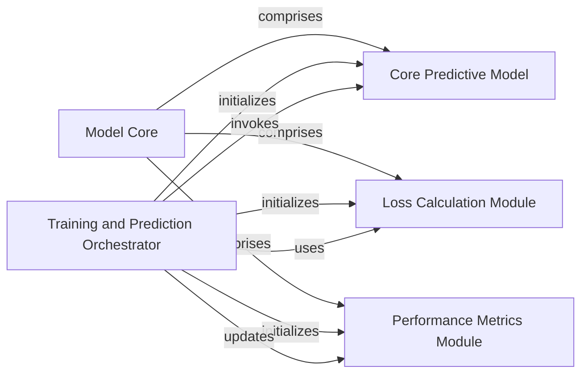

## Component Details

This component overview describes the core computational elements and their orchestration within the Decima model. The Model Core encapsulates the fundamental neural network architecture, custom loss function, and disease-specific evaluation metrics, forming the computational backbone. The Training and Prediction Orchestrator acts as the central controller, initializing and managing the flow of data through the Core Predictive Model, applying the Loss Calculation Module, and evaluating performance using the Performance Metrics Module throughout the training, validation, and prediction phases.

### Model Core
Encapsulates the fundamental neural network architecture (DecimaModel), the custom loss function (TaskWisePoissonMultinomialLoss), and the disease-specific evaluation metric (DiseaseLfcMSE). It forms the computational backbone of the Decima model.

**Related Classes/Methods**:

- <a href="https://github.com/Genentech/decima/blob/master/src/decima/decima_model.py#L11-L53" target="_blank" rel="noopener noreferrer">`decima.src.decima.decima_model.DecimaModel` (11:53)</a>
- <a href="https://github.com/Genentech/decima/blob/master/src/decima/loss.py#L6-L41" target="_blank" rel="noopener noreferrer">`decima.src.decima.loss.TaskWisePoissonMultinomialLoss` (6:41)</a>
- <a href="https://github.com/Genentech/decima/blob/master/src/decima/metrics.py#L6-L27" target="_blank" rel="noopener noreferrer">`decima.src.decima.metrics.DiseaseLfcMSE` (6:27)</a>

### Training and Prediction Orchestrator
This component serves as the primary controller for the entire machine learning pipeline. It initializes the core predictive model, the loss function, and performance metrics. It orchestrates the training, validation, and testing steps by managing data flow, invoking the forward pass of the predictive model, calculating loss, and updating metrics. It also handles prediction on new data.

**Related Classes/Methods**:

- <a href="https://github.com/Genentech/decima/blob/master/src/decima/lightning.py#L38-L455" target="_blank" rel="noopener noreferrer">`decima.src.decima.lightning.LightningModel` (38:455)</a>
- <a href="https://github.com/Genentech/decima/blob/master/src/decima/lightning.py#L50-L88" target="_blank" rel="noopener noreferrer">`decima.src.decima.lightning.LightningModel:__init__` (50:88)</a>
- <a href="https://github.com/Genentech/decima/blob/master/src/decima/lightning.py#L105-L126" target="_blank" rel="noopener noreferrer">`decima.src.decima.lightning.LightningModel:forward` (105:126)</a>
- <a href="https://github.com/Genentech/decima/blob/master/src/decima/lightning.py#L128-L133" target="_blank" rel="noopener noreferrer">`decima.src.decima.lightning.LightningModel:training_step` (128:133)</a>
- <a href="https://github.com/Genentech/decima/blob/master/src/decima/lightning.py#L135-L143" target="_blank" rel="noopener noreferrer">`decima.src.decima.lightning.LightningModel:validation_step` (135:143)</a>
- <a href="https://github.com/Genentech/decima/blob/master/src/decima/lightning.py#L162-L173" target="_blank" rel="noopener noreferrer">`decima.src.decima.lightning.LightningModel:test_step` (162:173)</a>
- <a href="https://github.com/Genentech/decima/blob/master/src/decima/lightning.py#L90-L103" target="_blank" rel="noopener noreferrer">`decima.src.decima.lightning.LightningModel.format_input` (90:103)</a>
- <a href="https://github.com/Genentech/decima/blob/master/src/decima/lightning.py#L223-L227" target="_blank" rel="noopener noreferrer">`decima.src.decima.lightning.LightningModel.reset_transform` (223:227)</a>

### Core Predictive Model
This component embodies the neural network architecture responsible for making predictions. It's a specialized BorzoiModel that takes one-hot encoded sequences as input and outputs raw predictions (logits) for various tasks. It can be initialized with pre-trained weights.

**Related Classes/Methods**:

- <a href="https://github.com/Genentech/decima/blob/master/src/decima/decima_model.py#L11-L53" target="_blank" rel="noopener noreferrer">`decima.src.decima.decima_model.DecimaModel` (11:53)</a>

### Loss Calculation Module
This component provides the specific loss function used to train the predictive model. It calculates a combined Poisson and Multinomial negative log-likelihood loss, which is crucial for guiding the model's learning process by quantifying the discrepancy between its predictions and the true target values.

**Related Classes/Methods**:

- <a href="https://github.com/Genentech/decima/blob/master/src/decima/loss.py#L6-L41" target="_blank" rel="noopener noreferrer">`decima.src.decima.loss.TaskWisePoissonMultinomialLoss` (6:41)</a>

### Performance Metrics Module
This component is responsible for computing specific evaluation metrics, such as the Mean Squared Error (MSE) on log-fold changes for disease-related tasks. It helps in assessing the model's performance beyond just the loss value, providing insights into its predictive accuracy on relevant biological outcomes.

**Related Classes/Methods**:

- <a href="https://github.com/Genentech/decima/blob/master/src/decima/metrics.py#L6-L27" target="_blank" rel="noopener noreferrer">`decima.src.decima.metrics.DiseaseLfcMSE` (6:27)</a>

### [FAQ](https://github.com/CodeBoarding/GeneratedOnBoardings/tree/main?tab=readme-ov-file#faq)