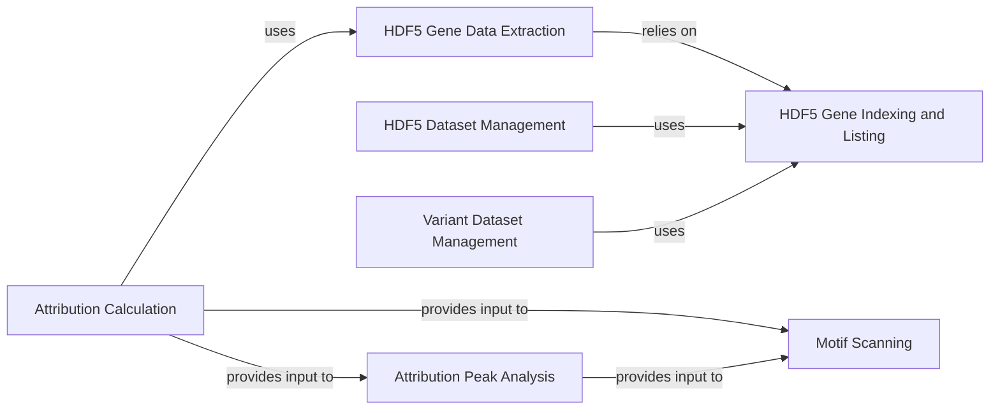

## Component Details

This graph outlines the components involved in model interpretation, specifically focusing on attribution analysis and data extraction from HDF5 files. The main flow involves extracting genomic data, calculating attributions using a trained model, and then analyzing these attributions to identify significant peaks and scan for motifs. The purpose is to provide insights into how the model makes predictions by highlighting important features in the genomic sequences.

### Attribution Calculation
This component is responsible for computing feature attributions for genomic sequences using a given model. It handles input data preparation, applies transformations to the model (e.g., specificity or aggregation), and performs the attribution calculation using methods like InputXGradient.

**Related Classes/Methods**:

- <a href="https://github.com/Genentech/decima/blob/master/src/decima/interpret.py#L13-L53" target="_blank" rel="noopener noreferrer">`decima.src.decima.interpret.attributions` (13:53)</a>

### Attribution Peak Analysis
This component identifies significant peaks within the calculated attribution scores. It sorts these peaks by height and can relate them to the transcription start site (TSS) position.

**Related Classes/Methods**:

- <a href="https://github.com/Genentech/decima/blob/master/src/decima/interpret.py#L56-L62" target="_blank" rel="noopener noreferrer">`decima.src.decima.interpret.find_attr_peaks` (56:62)</a>

### Motif Scanning
This component scans attribution scores and sequences for known motifs, providing a way to link high attribution regions to specific regulatory elements. It integrates with the attribution peaks to focus the scanning on relevant regions.

**Related Classes/Methods**:

- <a href="https://github.com/Genentech/decima/blob/master/src/decima/interpret.py#L65-L80" target="_blank" rel="noopener noreferrer">`decima.src.decima.interpret.scan_attributions` (65:80)</a>

### HDF5 Gene Data Extraction
This component provides functions to extract sequence and mask data for specific genes from HDF5 files. It can also merge sequence and mask data into a single tensor.

**Related Classes/Methods**:

- <a href="https://github.com/Genentech/decima/blob/master/src/decima/read_hdf5.py#L50-L64" target="_blank" rel="noopener noreferrer">`decima.src.decima.read_hdf5.extract_gene_data` (50:64)</a>

### HDF5 Gene Indexing and Listing
This component provides utilities for counting, indexing, and listing genes stored within an HDF5 file, allowing for efficient access and management of genomic data.

**Related Classes/Methods**:

- <a href="https://github.com/Genentech/decima/blob/master/src/decima/read_hdf5.py#L12-L18" target="_blank" rel="noopener noreferrer">`decima.src.decima.read_hdf5.count_genes` (12:18)</a>
- <a href="https://github.com/Genentech/decima/blob/master/src/decima/read_hdf5.py#L21-L27" target="_blank" rel="noopener noreferrer">`decima.src.decima.read_hdf5.index_genes` (21:27)</a>
- <a href="https://github.com/Genentech/decima/blob/master/src/decima/read_hdf5.py#L30-L36" target="_blank" rel="noopener noreferrer">`decima.src.decima.read_hdf5.list_genes` (30:36)</a>
- <a href="https://github.com/Genentech/decima/blob/master/src/decima/read_hdf5.py#L39-L41" target="_blank" rel="noopener noreferrer">`decima.src.decima.read_hdf5.get_gene_idx` (39:41)</a>

### HDF5 Dataset Management
This component provides a PyTorch Dataset implementation for loading and augmenting genomic sequence and label data from HDF5 files, suitable for training and prediction tasks.

**Related Classes/Methods**:

- <a href="https://github.com/Genentech/decima/blob/master/src/decima/read_hdf5.py#L74-L157" target="_blank" rel="noopener noreferrer">`decima.src.decima.read_hdf5.HDF5Dataset` (74:157)</a>

### Variant Dataset Management
This component provides a PyTorch Dataset implementation specifically designed for handling genomic variant data from HDF5 files, including sequence augmentation and allele mutation for variant effect prediction.

**Related Classes/Methods**:

- <a href="https://github.com/Genentech/decima/blob/master/src/decima/read_hdf5.py#L160-L249" target="_blank" rel="noopener noreferrer">`decima.src.decima.read_hdf5.VariantDataset` (160:249)</a>

### [FAQ](https://github.com/CodeBoarding/GeneratedOnBoardings/tree/main?tab=readme-ov-file#faq)