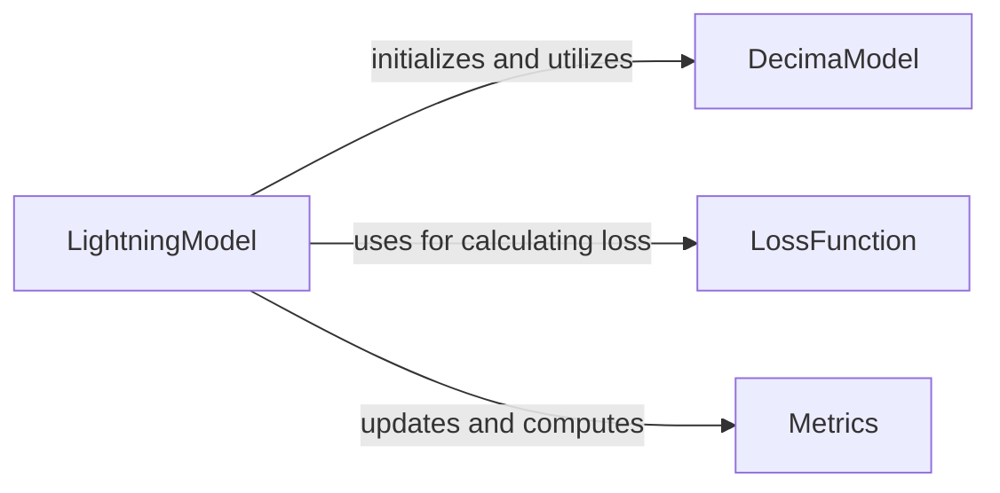

## Component Details

The Training and Prediction Orchestrator, primarily embodied by the `LightningModel`, manages the entire machine learning lifecycle for the Decima model within the PyTorch Lightning framework. It orchestrates model initialization, data loading, forward passes, training, validation, testing, and prediction steps. The main flow involves initializing the `LightningModel` with model, training, and data parameters, which in turn initializes the `DecimaModel`, `LossFunction`, and `Metrics` components. During training, it utilizes data loaders to feed data to the `DecimaModel`, calculates loss using `LossFunction`, and updates `Metrics`. For prediction, it processes input data through the `DecimaModel` and applies any necessary transformations.

### LightningModel
The LightningModel acts as a wrapper for predictive sequence models, handling model initialization, loss function setup, metric tracking, and the overall training, validation, testing, and prediction workflows. It integrates with PyTorch Lightning for streamlined deep learning operations.

**Related Classes/Methods**:

- <a href="https://github.com/Genentech/decima/blob/master/src/decima/lightning.py#L38-L455" target="_blank" rel="noopener noreferrer">`decima.src.decima.lightning.LightningModel` (38:455)</a>
- <a href="https://github.com/Genentech/decima/blob/master/src/decima/lightning.py#L50-L88" target="_blank" rel="noopener noreferrer">`decima.src.decima.lightning.LightningModel:__init__` (50:88)</a>
- <a href="https://github.com/Genentech/decima/blob/master/src/decima/lightning.py#L105-L126" target="_blank" rel="noopener noreferrer">`decima.src.decima.lightning.LightningModel:forward` (105:126)</a>
- <a href="https://github.com/Genentech/decima/blob/master/src/decima/lightning.py#L128-L133" target="_blank" rel="noopener noreferrer">`decima.src.decima.lightning.LightningModel:training_step` (128:133)</a>
- <a href="https://github.com/Genentech/decima/blob/master/src/decima/lightning.py#L135-L143" target="_blank" rel="noopener noreferrer">`decima.src.decima.lightning.LightningModel:validation_step` (135:143)</a>
- <a href="https://github.com/Genentech/decima/blob/master/src/decima/lightning.py#L162-L173" target="_blank" rel="noopener noreferrer">`decima.src.decima.lightning.LightningModel:test_step` (162:173)</a>
- <a href="https://github.com/Genentech/decima/blob/master/src/decima/lightning.py#L278-L338" target="_blank" rel="noopener noreferrer">`decima.src.decima.lightning.LightningModel:train_on_dataset` (278:338)</a>
- <a href="https://github.com/Genentech/decima/blob/master/src/decima/lightning.py#L358-L420" target="_blank" rel="noopener noreferrer">`decima.src.decima.lightning.LightningModel:predict_on_dataset` (358:420)</a>
- <a href="https://github.com/Genentech/decima/blob/master/src/decima/lightning.py#L422-L455" target="_blank" rel="noopener noreferrer">`decima.src.decima.lightning.LightningModel:get_task_idxs` (422:455)</a>
- <a href="https://github.com/Genentech/decima/blob/master/src/decima/lightning.py#L90-L103" target="_blank" rel="noopener noreferrer">`decima.src.decima.lightning.LightningModel.format_input` (90:103)</a>
- <a href="https://github.com/Genentech/decima/blob/master/src/decima/lightning.py#L223-L227" target="_blank" rel="noopener noreferrer">`decima.src.decima.lightning.LightningModel.reset_transform` (223:227)</a>
- <a href="https://github.com/Genentech/decima/blob/master/src/decima/lightning.py#L198-L214" target="_blank" rel="noopener noreferrer">`decima.src.decima.lightning.LightningModel.parse_logger` (198:214)</a>
- <a href="https://github.com/Genentech/decima/blob/master/src/decima/lightning.py#L229-L243" target="_blank" rel="noopener noreferrer">`decima.src.decima.lightning.LightningModel.make_train_loader` (229:243)</a>
- <a href="https://github.com/Genentech/decima/blob/master/src/decima/lightning.py#L245-L259" target="_blank" rel="noopener noreferrer">`decima.src.decima.lightning.LightningModel.make_test_loader` (245:259)</a>
- <a href="https://github.com/Genentech/decima/blob/master/src/decima/lightning.py#L261-L276" target="_blank" rel="noopener noreferrer">`decima.src.decima.lightning.LightningModel.make_predict_loader` (261:276)</a>
- <a href="https://github.com/Genentech/decima/blob/master/src/decima/lightning.py#L340-L353" target="_blank" rel="noopener noreferrer">`decima.src.decima.lightning.LightningModel._get_dataset_attrs` (340:353)</a>

### DecimaModel
The DecimaModel represents the core predictive sequence model architecture. It is responsible for processing input sequences and generating raw predictions (logits) before activation and any further transformations.

**Related Classes/Methods**:

- <a href="https://github.com/Genentech/decima/blob/master/src/decima/decima_model.py#L11-L53" target="_blank" rel="noopener noreferrer">`decima.src.decima.decima_model.DecimaModel` (11:53)</a>

### LossFunction
The LossFunction component, specifically TaskWisePoissonMultinomialLoss, calculates the discrepancy between the model's predictions and the true labels. It is crucial for guiding the model's learning process during training and evaluation.

**Related Classes/Methods**:

- <a href="https://github.com/Genentech/decima/blob/master/src/decima/loss.py#L6-L41" target="_blank" rel="noopener noreferrer">`decima.src.decima.loss.TaskWisePoissonMultinomialLoss` (6:41)</a>

### Metrics
The Metrics component, including DiseaseLfcMSE, is responsible for evaluating the performance of the model. It provides quantitative measures of how well the model is performing on various tasks.

**Related Classes/Methods**:

- <a href="https://github.com/Genentech/decima/blob/master/src/decima/metrics.py#L6-L27" target="_blank" rel="noopener noreferrer">`decima.src.decima.metrics.DiseaseLfcMSE` (6:27)</a>

### [FAQ](https://github.com/CodeBoarding/GeneratedOnBoardings/tree/main?tab=readme-ov-file#faq)