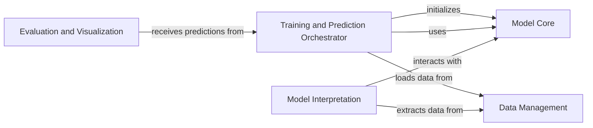

## Component Details

The `decima` project implements a neural network model for analyzing biological sequence and gene expression data. Its core functionality involves training a deep learning model, managing complex HDF5 datasets, and providing tools for model evaluation, visualization, and interpretation of predictions.

### Model Core
Encapsulates the fundamental neural network architecture (DecimaModel), the custom loss function (TaskWisePoissonMultinomialLoss), and the disease-specific evaluation metric (DiseaseLfcMSE). It forms the computational backbone of the Decima model.

**Related Classes/Methods**:

- <a href="https://github.com/Genentech/decima/blob/master/src/decima/decima_model.py#L11-L53" target="_blank" rel="noopener noreferrer">`decima.src.decima.decima_model.DecimaModel` (11:53)</a>
- <a href="https://github.com/Genentech/decima/blob/master/src/decima/loss.py#L6-L41" target="_blank" rel="noopener noreferrer">`decima.src.decima.loss.TaskWisePoissonMultinomialLoss` (6:41)</a>
- <a href="https://github.com/Genentech/decima/blob/master/src/decima/metrics.py#L6-L27" target="_blank" rel="noopener noreferrer">`decima.src.decima.metrics.DiseaseLfcMSE` (6:27)</a>

### Training and Prediction Orchestrator
Integrates the Decima model with the PyTorch Lightning framework, managing the entire machine learning lifecycle including model initialization, forward passes, training, validation, testing, and prediction steps. It handles data loading and orchestrates the training and prediction processes.

**Related Classes/Methods**:

- <a href="https://github.com/Genentech/decima/blob/master/src/decima/lightning.py#L38-L455" target="_blank" rel="noopener noreferrer">`decima.src.decima.lightning.LightningModel` (38:455)</a>

### Data Management
Responsible for reading, processing, and augmenting biological sequence and gene expression data stored in HDF5 files. It includes utilities for gene indexing, extracting specific data points, and defining dataset classes for efficient data loading during training and inference, including specific handling for variant data.

**Related Classes/Methods**:

- <a href="https://github.com/Genentech/decima/blob/master/src/decima/read_hdf5.py#L74-L157" target="_blank" rel="noopener noreferrer">`decima.src.decima.read_hdf5.HDF5Dataset` (74:157)</a>
- <a href="https://github.com/Genentech/decima/blob/master/src/decima/read_hdf5.py#L160-L249" target="_blank" rel="noopener noreferrer">`decima.src.decima.read_hdf5.VariantDataset` (160:249)</a>
- <a href="https://github.com/Genentech/decima/blob/master/src/decima/read_hdf5.py#L39-L41" target="_blank" rel="noopener noreferrer">`decima.src.decima.read_hdf5.get_gene_idx` (39:41)</a>
- <a href="https://github.com/Genentech/decima/blob/master/src/decima/read_hdf5.py#L30-L36" target="_blank" rel="noopener noreferrer">`decima.src.decima.read_hdf5.list_genes` (30:36)</a>
- <a href="https://github.com/Genentech/decima/blob/master/src/decima/read_hdf5.py#L50-L64" target="_blank" rel="noopener noreferrer">`decima.src.decima.read_hdf5.extract_gene_data` (50:64)</a>
- <a href="https://github.com/Genentech/decima/blob/master/src/decima/read_hdf5.py#L44-L47" target="_blank" rel="noopener noreferrer">`decima.src.decima.read_hdf5._extract_center` (44:47)</a>
- <a href="https://github.com/Genentech/decima/blob/master/src/decima/read_hdf5.py#L67-L71" target="_blank" rel="noopener noreferrer">`decima.src.decima.read_hdf5.mutate` (67:71)</a>
- <a href="https://github.com/Genentech/decima/blob/master/src/decima/preprocess.py#L268-L281" target="_blank" rel="noopener noreferrer">`decima.src.decima.preprocess.make_inputs` (268:281)</a>

### Evaluation and Visualization
Provides functionalities for quantitatively assessing the performance of the model, particularly focusing on marker gene analysis and criteria matching, and generates plots and visual representations of the model's evaluation results.

**Related Classes/Methods**:

- <a href="https://github.com/Genentech/decima/blob/master/src/decima/evaluate.py#L33-L37" target="_blank" rel="noopener noreferrer">`decima.src.decima.evaluate.compare_marker_zscores` (33:37)</a>
- <a href="https://github.com/Genentech/decima/blob/master/src/decima/evaluate.py#L20-L30" target="_blank" rel="noopener noreferrer">`decima.src.decima.evaluate.marker_zscores` (20:30)</a>
- <a href="https://github.com/Genentech/decima/blob/master/src/decima/evaluate.py#L8-L17" target="_blank" rel="noopener noreferrer">`decima.src.decima.evaluate.match_criteria` (8:17)</a>
- <a href="https://github.com/Genentech/decima/blob/master/src/decima/evaluate.py#L40-L71" target="_blank" rel="noopener noreferrer">`decima.src.decima.evaluate.compute_marker_metrics` (40:71)</a>
- <a href="https://github.com/Genentech/decima/blob/master/src/decima/visualize.py#L116-L201" target="_blank" rel="noopener noreferrer">`decima.src.decima.visualize.plot_marker_box` (116:201)</a>
- <a href="https://github.com/Genentech/decima/blob/master/src/decima/visualize.py#L9-L15" target="_blank" rel="noopener noreferrer">`decima.src.decima.visualize.plot_logo` (9:15)</a>
- <a href="https://github.com/Genentech/decima/blob/master/src/decima/visualize.py#L18-L62" target="_blank" rel="noopener noreferrer">`decima.src.decima.visualize.plot_gene_scatter` (18:62)</a>
- <a href="https://github.com/Genentech/decima/blob/master/src/decima/visualize.py#L65-L113" target="_blank" rel="noopener noreferrer">`decima.src.decima.visualize.plot_track_scatter` (65:113)</a>
- <a href="https://github.com/Genentech/decima/blob/master/src/decima/visualize.py#L204-L218" target="_blank" rel="noopener noreferrer">`decima.src.decima.visualize.plot_attribution_peaks` (204:218)</a>

### Model Interpretation
Provides tools and methods for interpreting the predictions and internal workings of the model, such as attribution analysis to understand feature importance and motif scanning.

**Related Classes/Methods**:

- <a href="https://github.com/Genentech/decima/blob/master/src/decima/interpret.py#L13-L53" target="_blank" rel="noopener noreferrer">`decima.src.decima.interpret.attributions` (13:53)</a>
- <a href="https://github.com/Genentech/decima/blob/master/src/decima/interpret.py#L56-L62" target="_blank" rel="noopener noreferrer">`decima.src.decima.interpret.find_attr_peaks` (56:62)</a>
- <a href="https://github.com/Genentech/decima/blob/master/src/decima/interpret.py#L65-L80" target="_blank" rel="noopener noreferrer">`decima.src.decima.interpret.scan_attributions` (65:80)</a>

### [FAQ](https://github.com/CodeBoarding/GeneratedOnBoardings/tree/main?tab=readme-ov-file#faq)